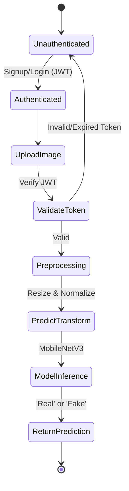
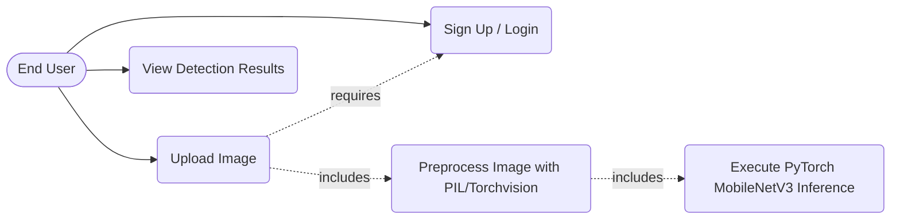
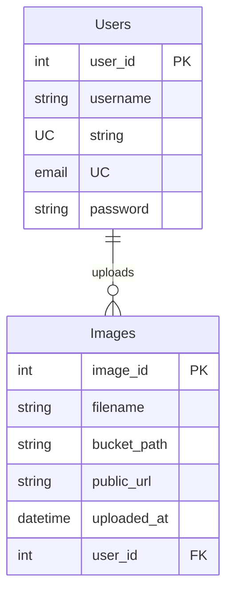

# Deepfake Detector Project

This project aims to implement a deepfake detection system using deep learning techniques.

## Tech Stack

The project utilizes the following technologies and libraries:

- **Deep Learning Framework:** PyTorch
- **Image Processing:** OpenCV (`opencv-python`), Pillow (`pillow`)
- **Web API Framework:** FastAPI
- **ASGI Server:** Uvicorn
- **Data Handling & Processing:** NumPy (`numpy`)
- **Visualization:** Matplotlib (`matplotlib`)
- **Progress Tracking:** tqdm (`tqdm`)
- **Other Utilities:** `python-multipart` (for file uploads in FastAPI)

## Project Structure

- `backend/`: API server implementation.
- `dataset/`: Training and validation datasets.
- `docs/`: Project documentation.
- `frontend/`: User interface implementation.
- `model/`: Deep learning model definitions and training/inference scripts.
- `venv/`: Virtual environment.

## Installation

Ensure you have Python installed, then install the dependencies:

```bash
pip install -r requirements.txt
```

## System Architecture & Design Diagrams

### 1. Overall Architecture
```mermaid
graph TD
    UI[Frontend Client] -->|1. Auth (Signup/Login)| API[FastAPI Server]
    API <-->|2. JWT & User Data| DB[(Relational Database)]
    UI -->|3. Upload Image + JWT| API
    API -->|4. Save Temporarily| Storage[(Local Disk)]
    API -->|5. Resize & Normalize (PIL, Torchvision)| CV[Image Preprocessing]
    CV -->|6. Normalized Image Tensors| DL[PyTorch Inference Engine - MobileNetV3]
    DL -->|7. Real/Fake Classification| API
    API -->|8. Detection Result Report| UI
```

### 2. Activity Flow Diagram


### 3. Use-Case View


### 4. Entity-Relationship (E-R) Diagram

