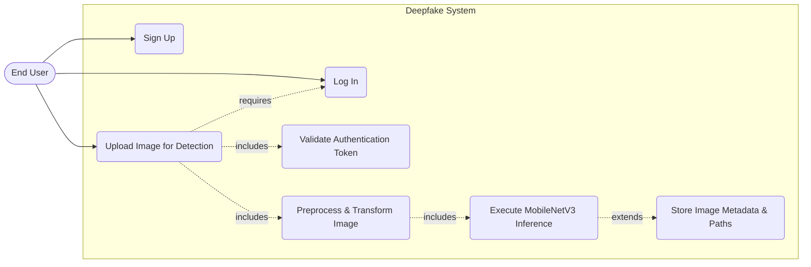
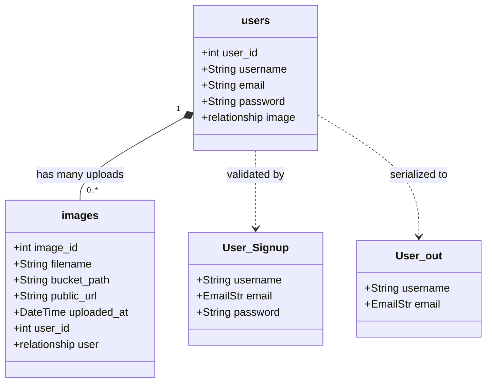
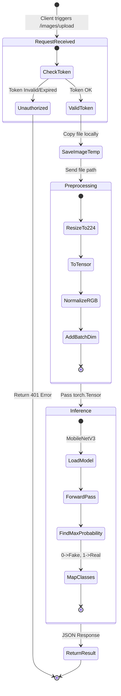
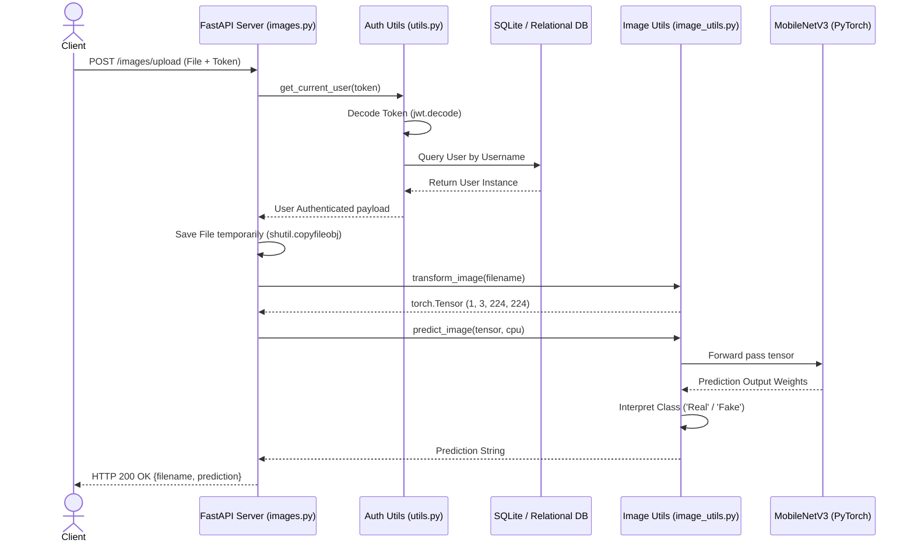
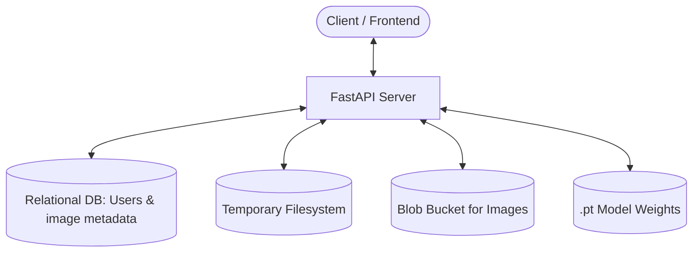
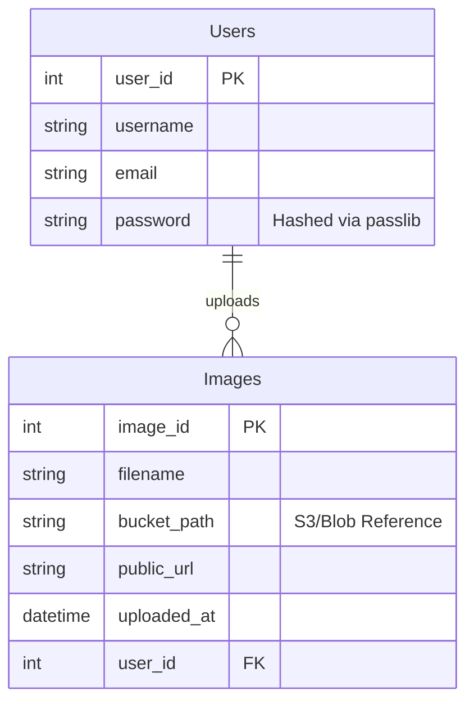

# Deepfake Detector: Design & UML Diagrams

This document contains detailed system architecture and UML diagrams for the Deepfake Detector project, generated from the current state of the codebase.

---

## 1. Use Case Diagram
This diagram highlights the main actions available to End Users and the underlying system processes involved.

---

## 2. Class Diagram
This diagram outlines the primary Database Models and Pydantic Schemas used for Object-Relational Mapping (ORM) and API validation.

---

## 3. Activity Diagram
This traces the flow of logic taking place when an Image Upload is requested on the `/images/upload` endpoint.

---

## 4. Sequence Diagram
This portrays the chronological interactions between the system's components during an image upload and prediction cycle.

---

## 5. Data Architecture Diagram
This diagrams out how user and asset metadata is structured alongside internal systems.

*(Below is the Entity-Relationship flow for strict database data architecture.)*

